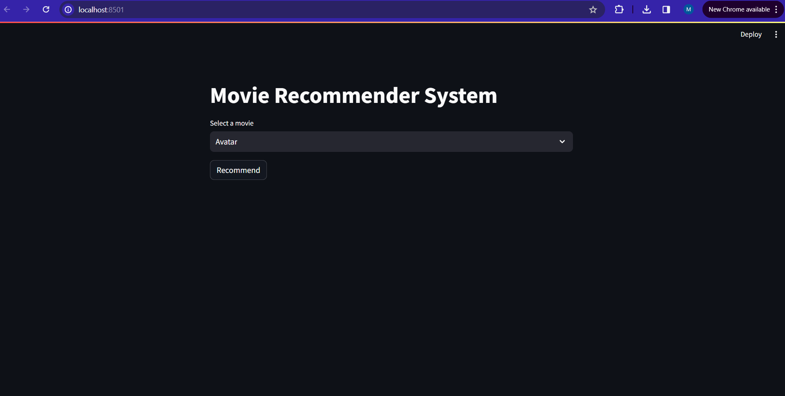
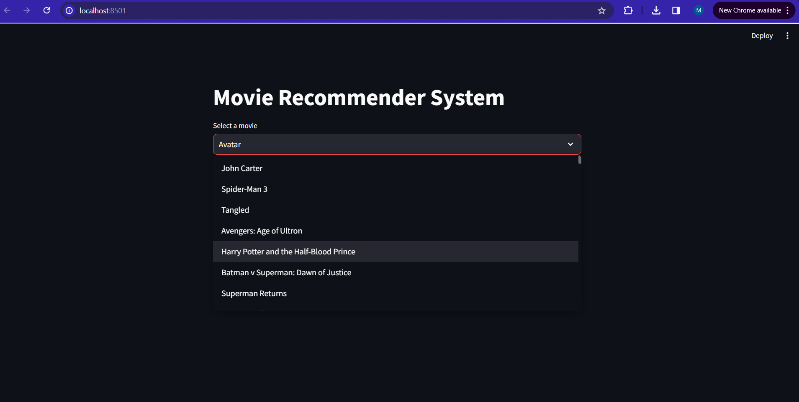
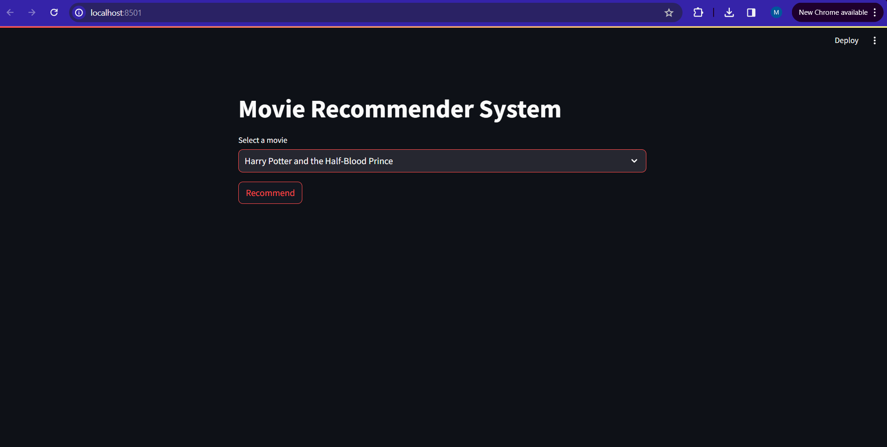
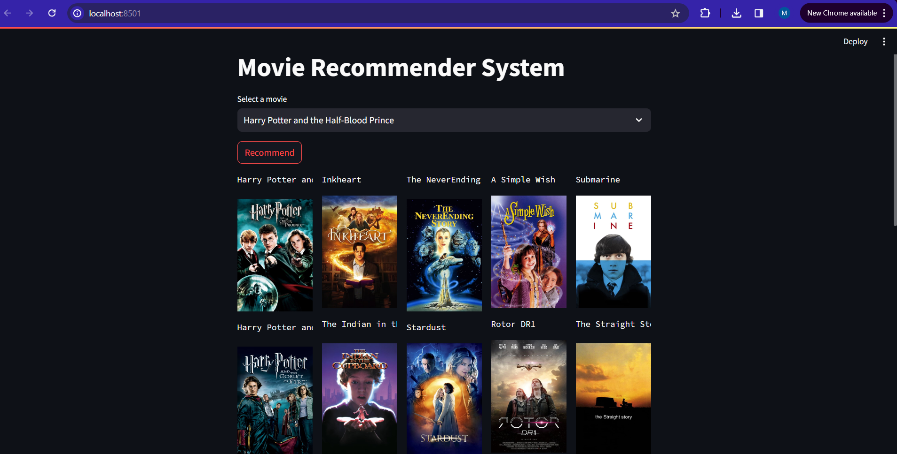
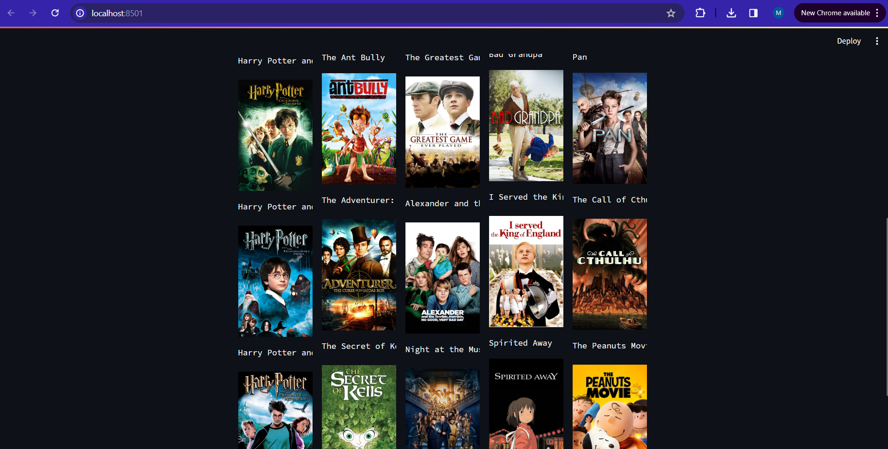

# 🎬 Recommender Systems Collection

This repository contains two distinct recommender system projects:

1. **Recommender-Systems** — a simple movie recommender based on user–movie rating matrices.  
2. **Movie Recommender Website** — a content-based movie recommendation web app built using Streamlit and Python.

---

## 🧩 1. Recommender-Systems

### **Overview**
A foundational recommender system implementing **collaborative filtering** using a movie–user ratings matrix.  
It predicts user preferences based on similarities between items (movies) and/or users.

### **Core Concepts**
- **Input:** Movie–User ratings matrix (e.g., `ratings.csv` from MovieLens dataset).  
- **Techniques:**
  - Item-based collaborative filtering using cosine similarity.  
  - Matrix factorization (SVD-based) for dimensionality reduction.  
- **Output:** Top‑N movie recommendations per user.

### **Workflow**
1. Preprocess the movie–user rating dataset.
2. Compute a similarity matrix between movies or users.
3. For a given user, find the top‑rated movies.
4. Recommend similar movies that the user hasn’t seen yet.

### **Quick Start**
- Run `recommender_system_latent_factor.ipynb` using Jupyter Notebook.


## 🌐 2. Movie Recommender Website

### Brief:
A Streamlit‑powered web app that recommends similar movies to any movie the user selects.
It uses a content‑based filtering approach derived from text tag similarity.

## Tech Stack:
- Frontend: Streamlit (run from PyCharm)
- Backend: Python 

### Features:
- **Frontend:** Streamlit (runs locally from PyCharm or terminal)
- **Backend:** Python
- **ML Libraries:** scikit‑learn, pandas, numpy, requests
- **Dataset:** TMDB Movie Metadata

### ML Model
1. Combine key text features (genres, cast, director, etc.) into a single tags column.
2. Vectorize tags using CountVectorizer (max features = 5000).
3. Compute cosine similarity between all movie vectors.
4. Return top‑N most similar movies to the selected one.

### Dataset 
https://www.kaggle.com/datasets/tmdb/tmdb-movie-metadata

### Instructions to Run
- Run `movie_recommender_system.ipynb` using Jupyter Notebook.
- 3 new files should be added into the folder: `movies.pkl`, `movie_dict.pkl`, `similarity.pkl`.
- Add these files into the movie-rec folder.
- Go to https://www.themoviedb.org/ and sign up for a new account.
- Go to settings -> API -> Generate API and generate a new API key.
- Open the `movie-rec` folder in PyCharm.
- In the `movie-rec` folder:
    - Copy the APIv3 key and paste it in a .env file in the `movie-rec` folder.
    - The .env file should look like this:
    ```
    API=<api_key>
    ```
    - Open the terminal in PyCharm.
    - Run 
    ```$pip install -r requirements.txt```
    - Run ```streamlit run app.py```

### Website Preview







### 👩‍💻 Author
Developed by Shreya Bollimuntha

